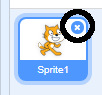
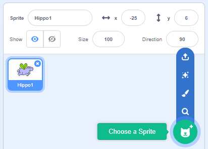
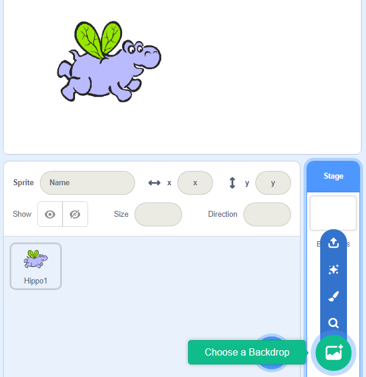
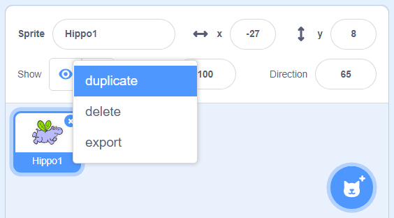

# Make some animated flying hippos! 

### Get started
* Open a new Scratch project and delete the cat **sprite** by clicking on the **x**.

* Click on the icon to **Choose a Sprite**, find the hippo with wings, and click on **OK**.

### Make the hippo fly
* Go to the **Code** tab and add the following code blocks to your sprite.

  These blocks makes the wings flap:
  
   
  
  These blocks make the hippo move around:
  
  

  Click on the green flag to see your animation! 

### Add a background
* In the bottom right-hand corner, you'll see the **Stage**. Click on the icon to **Choose a Backdrop** from the library. Or if you prefer, you can draw your own background by clicking on the **paintbrush** icon. 

  

### Make more things fly!
* Right-click on your sprite and select **duplicate**. Now there are two of them! Duplicate it as many times as you like. You can use the **delete** option to delete sprites. 

  

* Once you've duplicated the hippo sprite, change the costumes of the new sprite. If you want you could even try drawing costumes of your own!

  

  Top tip: you can **duplicate** a costume too! Doing this makes it easy to create two costumes that are nearly the same. 

**Why not turn your animation into a game?** Visit dojo.soy/sp-scratch-begin to see how it's done with the Beginner Scratch Sushi Cards, and also earn yourself a digital badge!

To see this card online or print out more, go to dojo.soy/sp-sushi-scratch.
