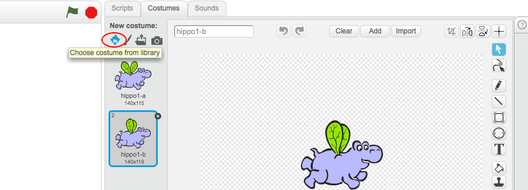
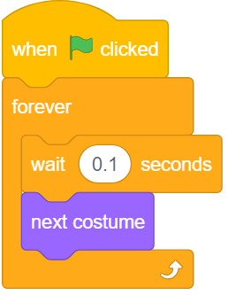
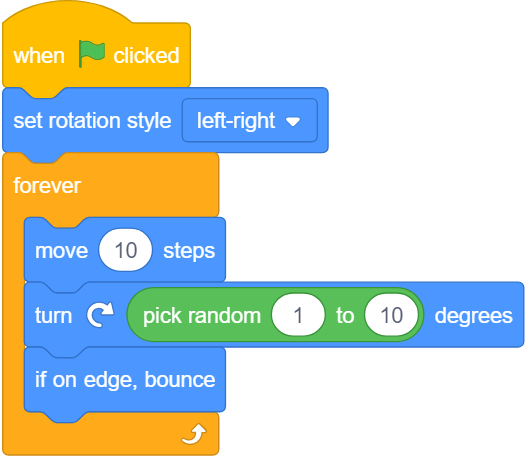
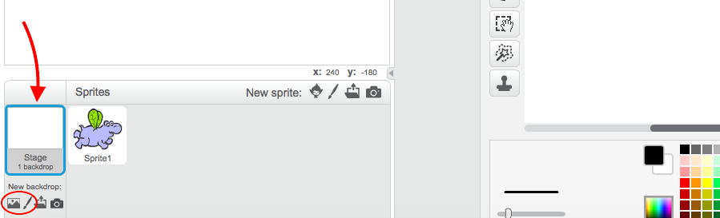
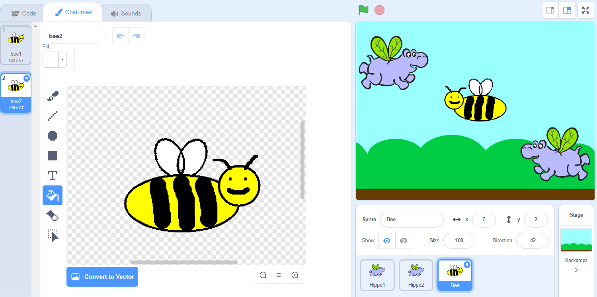

# Make some animated flying hippos! 

* Open a new Scratch project. Click on the cat **sprite** and go to the **Costumes** tab. Click the first icon under **New costume** to choose a costume from the library.   

* Find the *flying hippo*. There are two: select one of them and click **OK**. Then add another costume the same way, and select the other flying hippo. Delete the two cat costumes by clicking on the little **x**. 

### Code to make the hippo fly
* In the **Sprites** panel, click your sprite. Add the following scripts to your sprite.

  This code makes the wings flap:
  
   
  
  These blocks make the hippo move around:
  
  

  Click on the green flag to see your animation! 

### Add a background
* In the bottom left-hand corner, you'll see the **Stage**. Click the first icon under **New Backdrop** to choose a backdrop from the library. If you prefer, you can draw your own background by clicking on the **paintbrush** icon instead. 

### Make more things fly!
* Click on the **duplicate** icon next to the scissors, and then click your sprite. Now there are two of them! Duplicate it as many times as you like. You can use the **scissors** button to delete sprites. 

* Once you've duplicated the hippo, you can change the costumes on the new sprite if you want. Why not try drawing your own costumes? 

  Top tip: you can **duplicate** a costume too! This makes it easy to draw two that are nearly the same. 

Why not turn your animation into a game? Visit dojo.soy/mini-scratch-begin to find out how with the Beginner Scratch Sushi Cards, and earn yourself a digital badge too! To see this card online or print out more, go to dojo.soy/mini-sushi-scratch.
